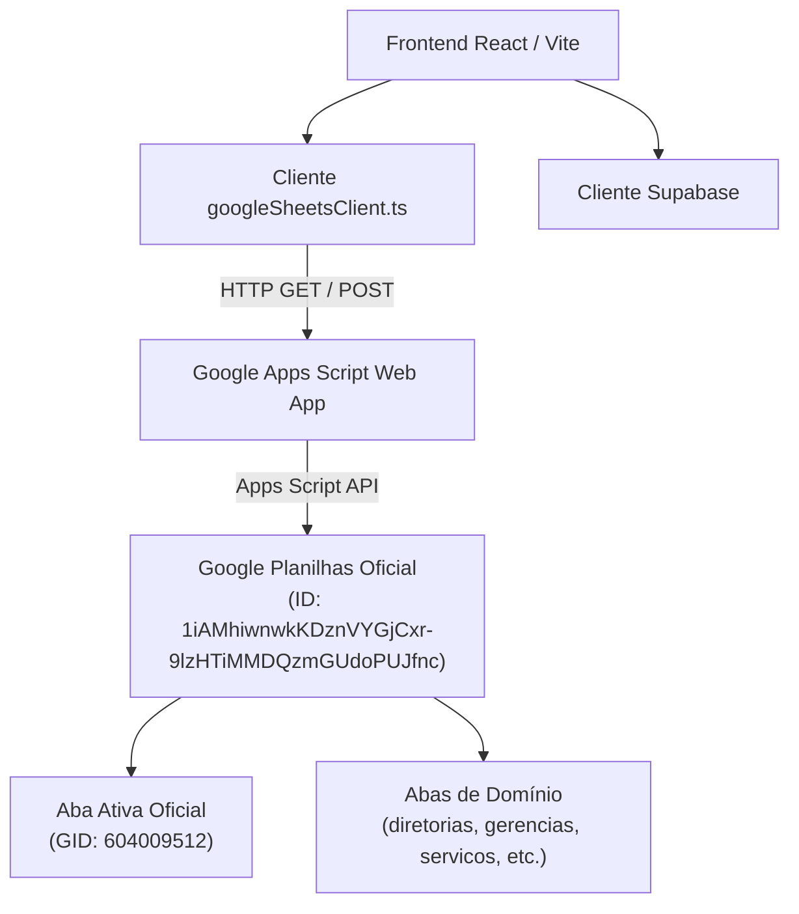

# Arquitetura Google Planilhas — PAC 2027 (Plano Anual)

Este documento descreve a integração da **Planilha Google Oficial** na arquitetura técnica do sistema de Planejamento Anual de Contratações (PAC 2027), detalhando identificadores, modelo de comunicação, mapeamento de dados e procedimentos operacionais.

---

## 1. Identificadores e Endpoints Oficiais

| Parâmetro | Valor |
| :--- | :--- |
| **URL da Planilha Oficial** | `https://docs.google.com/spreadsheets/d/1iAMhiwnwkKDznVYGjCxr-9lzHTiMMDQzmGUdoPUJfnc/edit?gid=604009512#gid=604009512` |
| **Spreadsheet ID** | `1iAMhiwnwkKDznVYGjCxr-9lzHTiMMDQzmGUdoPUJfnc` |
| **Aba Alvo (GID)** | `604009512` |
| **Google Apps Script Web App** | `https://script.google.com/macros/s/AKfycbzDfO2wQoN-i7u1NlR_k5IK64WwlthyY0JgebAq3fH0Q56fLjcTXDic1iMUTTmKvl4/exec` |

---

## 2. Visão Geral da Arquitetura

O sistema opera com suporte a **arquitetura híbrida / redundante**:



### Principais Características:
1. **Custo Zero**: Não requer servidores dedicados para a camada de persistência em planilha.
2. **Execução sem Preflight CORS**: O cliente `googleSheetsClient.ts` envia requisições `POST` usando formato padrão para compatibilidade com os redirecionamentos HTTP 302 do Google Apps Script.
3. **Resolução Dinâmica por GID**: Suporte à localização e consulta direta da aba `604009512` via método `getSheetByGid(gid)`.
4. **Resiliência e Fallback Transparente**: Se o backend do Google Sheets estiver indisponível ou uma ação retornar erro, as operações de leitura e fallback continuam garantidas sem interromper a aplicação.

---

## 3. Variáveis de Ambiente (.env)

```env
# Banco de Dados e Serviços
VITE_SUPABASE_URL=https://icyawlvdmlcndsjpudle.supabase.co
VITE_SUPABASE_ANON_KEY=sb_publishable_...

# Google Apps Script & Planilha Oficial
VITE_GOOGLE_SCRIPT_URL=https://script.google.com/macros/s/AKfycbzDfO2wQoN-i7u1NlR_k5IK64WwlthyY0JgebAq3fH0Q56fLjcTXDic1iMUTTmKvl4/exec
VITE_GOOGLE_SPREADSHEET_URL=https://docs.google.com/spreadsheets/d/1iAMhiwnwkKDznVYGjCxr-9lzHTiMMDQzmGUdoPUJfnc/edit?gid=604009512#gid=604009512
VITE_GOOGLE_SPREADSHEET_ID=1iAMhiwnwkKDznVYGjCxr-9lzHTiMMDQzmGUdoPUJfnc
VITE_GOOGLE_SPREADSHEET_GID=604009512
```

---

## 4. Estrutura de Abas na Planilha

| Nome da Aba | Função no Sistema |
| :--- | :--- |
| `diretorias` | Cadastro de Diretorias (DG, DE, DC, DO, PR) |
| `gerencias` | Cadastro de Gerências vinculadas às diretorias |
| `periodos` | Períodos do PAC (início, fim, ativo) |
| `codigos_acesso` | Códigos de acesso para autenticação por escopo |
| `solicitacoes` | Aquisições cadastradas pelas gerências |
| `servicos` | Contratações de serviços continuados / novos |
| `servicos_catalogo` | Catálogo base de serviços |
| `itens_catalogo` | Catálogo oficial de materiais |
| `logs_atividades` | Trilha de auditoria e exclusões lógicas |
| `log_orcamentario` | Trilha financeira do Mini-ERP |
| `admin_config` | Limites orçamentários por diretoria |
| `restricoes_atividades` | Bloqueios e janelas operacionais por perfil |

---

## 5. Como Atualizar a Implantação no Google Apps Script

Sempre que o arquivo local `google_apps_script.js` for atualizado:

1. Acesse a planilha oficial:
   `https://docs.google.com/spreadsheets/d/1iAMhiwnwkKDznVYGjCxr-9lzHTiMMDQzmGUdoPUJfnc/edit?gid=604009512#gid=604009512`
2. No menu superior, clique em **Extensões** > **Apps Script**.
3. Selecione todo o código no editor e substitua pelo conteúdo atualizado de [`google_apps_script.js`](file:///c:/Users/noell/Downloads/Projetos/plano-anual-2027-oficial/google_apps_script.js).
4. No canto superior direito, clique em **Implantar** > **Gerenciar Implantações**.
5. Clique no ícone de lápis (**Editar**).
6. Altere o campo **Versão** para **Nova versão**.
7. Clique em **Implantar**.

---

## 6. Garantia de Não-Regressão

Em conformidade com a diretriz do projeto:
- Não foram modificados fluxos de aprovação, envio ou rejeição.
- Telas operacionais e componentes de formulário permanecem intactos.
- O acesso à planilha foi adicionado de forma pontual e incremental através de botões e constantes isoladas.
